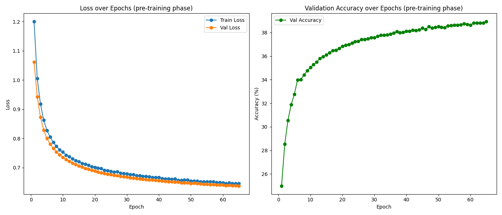
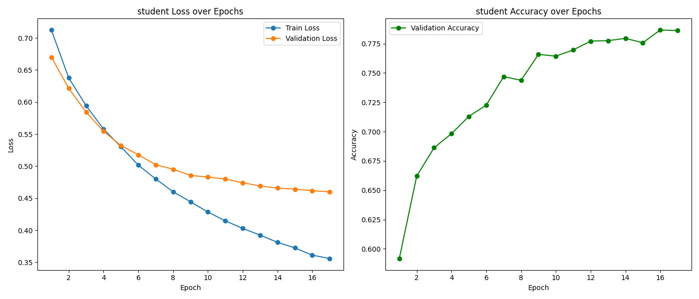

# Knowledge Distillation Framework to enhance performance of Small Language Model (SLM)

### Project Overview

This project investigates the application of `knowledge distillation` to compress large-scale 
Transformer models for natural language processing tasks. In our approach, 
a large teacher model (a full-scale **BERT** model) is first used to guide the `pre-training` of a 
smaller student model on a large corpus (`WikiText-103`). The pre-trained student model is 
subsequently fine-tuned on downstream tasks from the `GLUE (SST-2)` and `SQuAD` benchmarks. 
Analysis done on training and validation losses, convergence behavior, and evaluation metrics 
such as accuracy and F1 score. Experiments aim to demonstrate that the `distilled student model` 
can achieve competitive performance while significantly reducing model size and computational 
requirements.

### Methodology

#### Teacher and Student Models

> Teacher Model:

A pre-trained BERT model (e.g., BERT-large) that has been trained on massive corpora and fine-tuned 
on downstream tasks. The teacher model provides soft target distributions and intermediate hidden 
representations during the knowledge distillation process.

> Student Model:

A smaller variant of BERT (with **6 layers**) that is trained via knowledge distillation. 
The student model is optimized to mimic the teacher's output (both `logits` and `hidden states`) on 
the WikiText-103 dataset, thereby inheriting much of the teacher’s linguistic knowledge with 
reduced model complexity.

#### Pre-training Phase

During pre-training, the student model learns to approximate the teacher's output using a combined 
loss that includes both the cross-entropy loss (for language modeling) and the `KL divergence loss` 
(for distillation). The WikiText-103 dataset is used for pre-training, and distributed training 
(using `DDP`) and mixed precision (`AMP`) are employed to accelerate the process. 
Checkpointing and early evaluation are integrated to monitor convergence.

> Key Metrics:

- **Train Loss (CLD-Loss)**: Convergence of the knowledge distillation loss.
- **Validation Loss**: Monitors the generalization of the distilled student.

- **Convergence Plots:**




#### Fine-tuning Phase

After pre-training, the student model is fine-tuned on downstream tasks:

- GLUE (SST-2):

A text classification task where the student and teacher models are fine-tuned on the GLUE SST-2 
dataset. We monitor training and validation losses as well as classification accuracy.

> Key Metrics:

- **Train Loss & Validation Loss**: Monitored per epoch.
- **Validation Accuracy**: Percentage of correctly classified examples.

- **Example Plot**:




#### Convergence Analysis

Our experiments include detailed logging of training and validation losses along with evaluation 
metrics over epochs. Despite slow convergence in the pre-training phase—typical for large-scale 
language modeling—the gradual decrease in loss indicates that the student model is learning 
meaningful representations from the teacher. The fine-tuning results demonstrate that, 
after task-specific adaptation, the student model achieves competitive performance relative to 
the teacher model.

### Experimental Setup

- **Pre-training Data**: WikiText-103
- **Downstream Datasets**: GLUE SST-2 and SQuAD
- **Distributed Training**: Utilized PyTorch DistributedDataParallel (`DDP`) for scalability.
- **Mixed Precision**: Automatic Mixed Precision (AMP) used to accelerate training.
- **Checkpointing**: Models and metrics are saved periodically to enable resumption in case of interruptions.

### How to Run

> To run on distributed environment (**Pre-training**)
```shell
torchrun --nproc_per_node=1 ddp_main.py
```
> To run in background using `nohup` (**Pre-training**)

```shell
nohup torchrun --nproc_per_node=4 ddp_main.py > logs/output.log 2>&1 &
```

> To run in background for GLUE (**Fine-tuning**)
```shell
nohup python finetuneit.py > logs/output.log 2>&1 &
```

[//]: # (> To run in background for SQaD &#40;**Fine-tuning**&#41;)

[//]: # (```shell)

[//]: # (nohup torchrun --nproc_per_node=4 ddp_finetune_squad.py > logs/output.log 2>&1 &)

[//]: # (```)

> To run on benchmark for visualisation (**benchmark**)
```shell
python compare_benchmarks.py
```


### Conclusion

This project demonstrates that knowledge distillation can effectively transfer the capabilities 
of a large Transformer model (teacher) to a compact student model. While pre-training convergence 
is gradual, fine-tuning on downstream tasks shows that the student model can achieve competitive 
performance with significant reductions in computational cost. Future work will explore further 
hyperparameter tuning, alternative distillation strategies, and more comprehensive evaluations on 
additional benchmarks.

### Citation

If you use or extend this work, please cite our project as follows:

```bibtex
@inproceedings{kdslm,
  title={Knowledge Distillation for Transformer Models: Pre-training and Fine-tuning},
  author={Navneet and Dr. Pramod Murthy},
  publisher = {GitHub},
  journal = {GitHub repository},
  year={2025},
  howpublished = {\url{https://github.com/navneet1083/kdslm}},
}
```